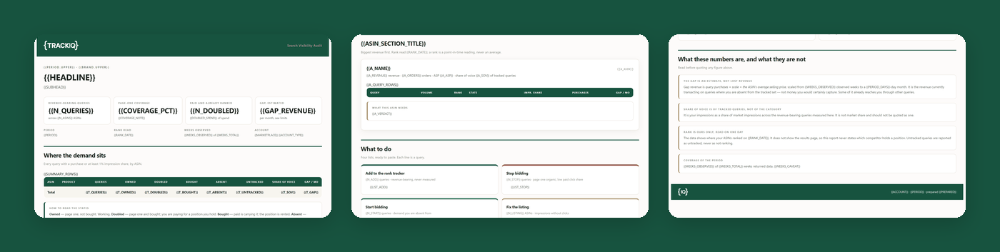

# TrackIQ: Amazon Search Visibility Audit

Answers one question per ASIN: **where do we actually show up in search, and
what is the gap worth?**

The finding is usually the overlap. Brands buy terms they already rank page
one for, and leave the terms they don't rank on to everyone else — and
neither shows up in a report that looks at paid and organic separately.

Built as an [Agent Skill](https://code.claude.com/docs/en/skills). Runs in
Claude Code, Claude web, Claude desktop and ChatGPT from the same folder.

---

## Powered by the TrackIQ MCP

This skill reads your live Amazon account through the
**[TrackIQ MCP](https://trackiq.com/mcp)** — 16 tools connecting your AI
assistant to Amazon data:

Sales & Traffic · Orders · Inventory · Returns · Sponsored Products · Sponsored
Brands · Sponsored Display · Amazon DSP · AMC Cloud · Keywords · Search Terms ·
Targeting · Search Query Performance · Organic Rank · Best Seller Rank · Buy Box
History · Brand Analytics · Export

**No third-party API required.** There is no scraping step, no SERP vendor and
no price-history provider — every input comes from the TrackIQ MCP.

Works with Claude, ChatGPT and Cursor. **[Get access →](https://trackiq.com/mcp)**

---

## What you get



*One report, three views: the coverage summary, a per-ASIN query table with
the four states, then what to do and what the numbers are not.*

One self-contained `.html` report.

### Every query lands in one of four states

| State | Organic | Paid | What it means |
|---|---|---|---|
| **Owned** | page 1 | not bought | Working. Defend it. |
| **Doubled** | page 1 | bought | You're paying for a position you already hold |
| **Bought** | page 2+ or unranked | bought | Paid is carrying it — the position is rented |
| **Absent** | page 2+ or unranked | not bought | Demand you aren't serving |

**Untracked is reported separately**, never folded into "not ranking". A query
with no rank row was never measured — that's a different finding with the
opposite action, and conflating the two invents a visibility problem that may
not exist.

### It ends in four lists, ready to paste

- **Add to the rank tracker** — revenue-bearing, never measured
- **Stop bidding** — page-one organic, low paid click share
- **Start bidding** — demand you're absent from
- **Fix the listing** — impressions without clicks

The last one is what a pure rank report misses. High impressions and low
clicks is a listing problem, not a rank problem, and it's usually the cheapest
fix on the page.

## Requirements

- The **TrackIQ MCP**, for `get_keyword_rank`, `get_search_query_performance`,
  `get_search_terms`, `get_targets`, `get_product_performance`, `show_products`
  and `list_marketplaces`
- Nothing else. No filesystem, no shell, no internet, no third-party API.

**Without the MCP** it works from a rank-tracker export, a Search Query
Performance export and a search-term report plus revenue by ASIN. Every
section except share-of-voice movement is reproducible that way.

---

## Install

### Claude Code

```
/plugin marketplace add TrackIQ-HQ/amazon-seller-skills
/plugin install trackiq-amazon-search-visibility-audit@trackiq
```

### Claude web, desktop, mobile

1. Download the `.zip` from the
   [latest release](https://github.com/TrackIQ-HQ/trackiq-amazon-search-visibility-audit/releases)
2. **Settings → Capabilities → Skills** (code execution must be on)
3. **Create skill → Upload a skill**, choose the `.zip`
4. Toggle it on

### ChatGPT

Same zip. **Plugins → Skills → Create → Upload from your computer.**

---

## Setup

Answers live in `account.md`, copied from
[`assets/account.example.md`](skills/trackiq-amazon-search-visibility-audit/assets/account.example.md).
**Every TrackIQ skill reads the same file**, so an account already set up for
another TrackIQ report needs nothing added.

## Delivery

Asked once and stored in `account.md`: **in-chat** (default), **file**,
**Slack**, **n8n** or **email**. Anything leaving the chat confirms with you
first and falls back to in-chat, with a note, when the channel isn't available.

## When to run it

Monthly, or before and after a listing change. It pairs with
[Category Priority Keywords](https://github.com/TrackIQ-HQ/trackiq-amazon-category-priority-keywords):
that one decides **which** terms are worth tracking and prices them, this one
reports **how you're doing** on them and what the untracked ones are costing.

---

## Customizing

| To change | Edit |
|---|---|
| Brand, ASINs in scope, delivery | `account.md` — no skill edits |
| The four states, share of voice, gap valuation | `assets/method.md` |
| The pull sequence and its traps | `assets/pulls.md` |
| The pre-send checks | `assets/checks.md` |
| The report shell | `assets/report-template.html` |

Four rules are load-bearing and worth leaving alone.

**Rank is a point-in-time reading, never an average.** A term that sat at 4 for
twenty-nine days and 60 for one is not "rank 6".

**Untracked is not unranked.** Both produce no rank row; they are opposite
findings.

**Never claim a competitor holds a position.** The data shows your rank, not
the results page.

**Share of voice is of the tracked queries, not of the category.** Labelled
that way everywhere it appears, because a client who reads it as market share
will quote it back in a board deck.

---

## Contributing

```bash
python scripts/validate.py    # must exit 0 before any commit
python scripts/build.py       # writes dist/ zip + registry.json
```

Read [AUTHORING.md](https://github.com/TrackIQ-HQ/amazon-seller-skills/blob/main/AUTHORING.md)
before proposing changes.

## License

MIT. See [LICENSE](LICENSE).
